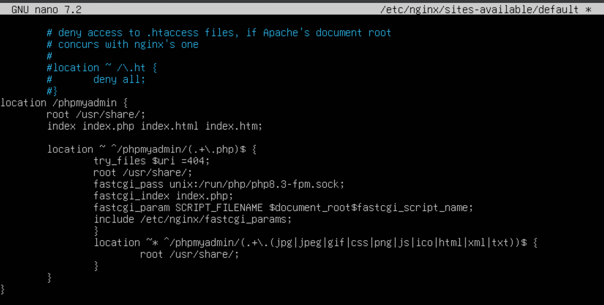

**Objectiu** 

>• Instal·lar, assegurar i configurar phpMyAdmin en un servidor Ubuntu.
>• Protegir PhpMyAdmin contra accessos no autoritzats.
>• Automatitzar la instal·lació i configuració de phpMyAdmin mitjançant scripts de Bash. 

## Tasques a fer 

### Instal·lació de PhpMyAdmin 

##### Instal·la phpMyAdmin juntament amb les extensions PHP necessàries (php-mbstring, php-zip, php-gd, php-json, php-curl).

##### Configura phpMyAdmin perquè funcione amb nginx. 

Al fitxer default de la ruta que es veu a la seguent captura he ficat les seguents linies de configuració.

Una vegada configurat correctament, ficant al navegador la IP del servidor i /phpmyadmin, veurem la seguent pantalla que si ens identifiquem, podrem accedir dins.

### Permetre l’Accés per Contrasenya del root de MySQL

##### Canvia el mètode d’autenticació de l’usuari root de MySQL d’auth_socket a caching_sha2_password o mysql_native_password.

Pel que es pot veure, el mètode d'autenticació al que volem canviar ja es troba aplicat, per tant, no es necessari canviar-ho.

En cas de que no estiguera canviat i a la columna plugin es trobara el mode *auth_socket*, s'hauria d'emprar este comandament:

> *ALTER USER 'root'@'localhost' IDENTIFIED WITH 'caching_sha2_password' BY 'contrasenya';*

Seguidament he canviat la contrassenya de root per a que siga 8448.

      
##### Verifica els mètodes d’autenticació utilitzats per cadascun dels usuaris. 

El mètodes es poden veure a la seguent captura que es la mateixa que es veu dalt per a comprovar quin metode tenien els usuaris degut que al tractar de fer el comandament citat, ens ixia un error.

### Configuració de l’Accés per Contrasenya per a un Usuari Dedicat de MySQL 

##### Crea un nou usuari de MySQL amb una contrasenya segura.
      

      
##### Dona-li al usuari els privilegis apropiats per gestionar les bases de dades a través de phpMyAdmin. 

### Assegura la Instància de phpMyAdmin 

##### Crea un fitxer .htpasswd per emmagatzemar les credencials d’usuari i contrasenya. 

Per al usuari franHT la contra es 8448

Si s’ha d’afegir més usuaris, l’opció -c del comandament anterior no s’ha de ficar per tal de no sobreescriure el fitxer

##### Modifica la configuració del lloc per aplicar l’accés per usuari i contrassenya.

Al fitxer de configuració, he afegit les 2 linies **auth_basic** y **auth_basic_user_file** que es veuen al fitxer de configuració a la seguent imatge.

##### Reinicieu nginx per aplicar els canvis. 

Ara una vegada reiniciat el servici veguem que ens demana credencials

Una vegada les fiquem podem accedir de nou al servidor, si ens tornem a identificar amb les claus del PHP.
Es a dir, que després de ficar les credencials valides on es veu a la captura superior, ens apareix la pantalla que ens ixia primera abans per a accedir a la base de dades.

---

### Repositori de GitHub + GitHub Pages
He creat el repositori de GitHub que es veu a la seguent imatge amb les carpetes i fitxers propis de mkdocs.
Dins de docs es troben els fitxers markdown i les imatges.
[Enllaç a GitHub](https://github.com/fransg006/phpmyadminFran.git)

Després per a pujar els canvis a GitHub Pages i així tindre un lloc web, he fet el seguent, i es pot veure al seguent enllaç 
[Enllaç a GitHub Pages]()

--- 

