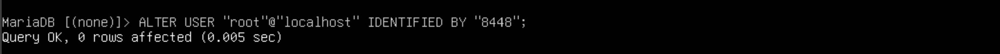
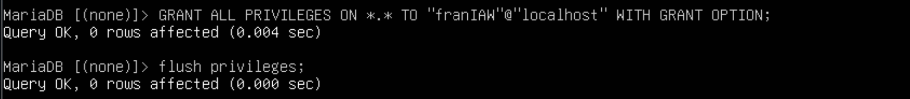
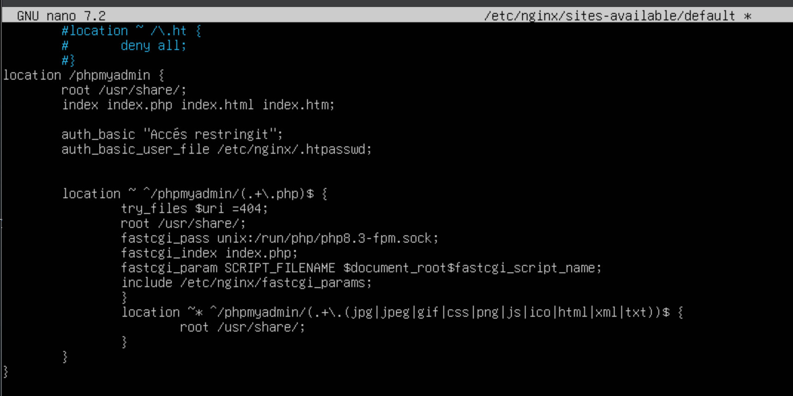
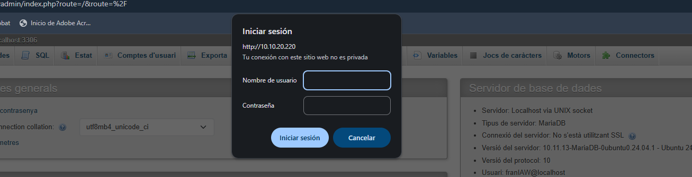

Objectiu 

• Instal·lar, assegurar i configurar phpMyAdmin en un servidor Ubuntu.
• Protegir PhpMyAdmin contra accessos no autoritzats.
• Automatitzar la instal·lació i configuració de phpMyAdmin mitjançant scripts de Bash. 

Tasques a fer 

## Instal·lació de PhpMyAdmin 

##### Instal·la phpMyAdmin juntament amb les extensions PHP necessàries (php-mbstring, php-zip, php-gd, php-json, php-curl).

##### Configura phpMyAdmin perquè funcione amb nginx. 

IMG3
IMG4

## Permetre l’Accés per Contrasenya del root de MySQL

> Canvia el mètode d’autenticació de l’usuari root de MySQL d’auth_socket a caching_sha2_password o mysql_native_password.
      
      
> Verifica els mètodes d’autenticació utilitzats per cadascun dels usuaris. 
      

Configuració de l’Accés per Contrasenya per a un Usuari Dedicat de MySQL 

    • Crea un nou usuari de MySQL amb una contrasenya segura.
      
      
    • Dona-li al usuari els privilegis apropiats per gestionar les bases de dades a través de phpMyAdmin. 

Assegura la Instància de phpMyAdmin 

    • Crea un fitxer .htpasswd per emmagatzemar les credencials d’usuari i contrasenya. 

Per al usuari franHT la contra es 8448
Si s’ha d’afegir més usuaris, l’opció -c del comandament anterior no s’ha de ficar per tal de no sobreescriure el fitxer

    • Modifica la configuració del lloc per aplicar l’accés per usuari i contrassenya.

    • Reinicieu nginx per aplicar els canvis. 

Com Lliurar 
Hauràs de crear un repositori a GitHub amb el nom de la pràctica i la descripció de la mateixa. 
El repositori ha de tenir el contingut següent:

    • Una documentació tècnica al vostre repositori de Github, i publicat a Github Pages amb la descripció de tots els passos que s’han dut a terme.
      
    • Els passos detallats que vas seguir per completar cadascun dels requisits.
    • Instal·lació i configuració de phpMyAdmin.
    • Configuració d’autenticació i mètodes d’autenticació de MySQL i Nginx.
    • Els scripts de Bash que s’han utilitzat per automatitzar la instal·lació i configuració de PhpMyAdmin.
    • Captures de pantalla demostratives dins de la documentació. 
...

